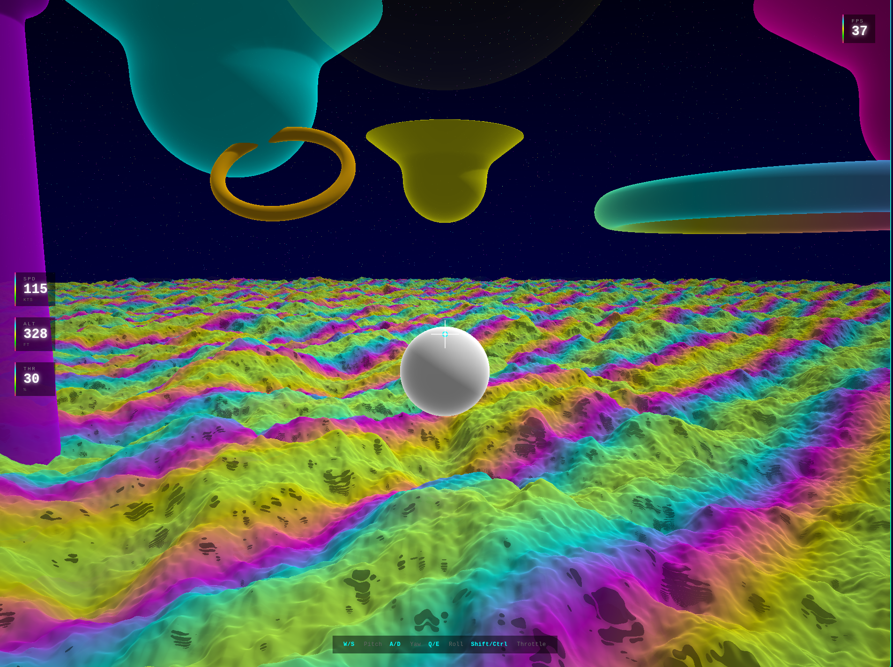

# Webhawk



A 3D WebGPU raymarched flight game inspired by Warhawk for the PS3. This project is an attempt to vibecode the entire game from scratch.

## About

Webhawk is an arcade-style dogfighting game rendered entirely through signed distance functions (SDFs) using WebGPU raymarching. The terrain, structures, and aircraft are all defined mathematically and rendered in real-time on the GPU.

## Tech Stack

- **WebGPU** - Next-generation graphics API for the web
- **WGSL** - WebGPU Shading Language for raymarching and SDF rendering
- **React** - UI layer and HUD overlay
- **TypeScript** - Type-safe game engine code
- **Vite** - Fast build system and dev server

## Features

- Full SDF raymarched world (mountains, floating islands, pillars, rings)
- Local-space flight physics with quaternion-based rotation
- Bold rainbow color palette with black negative space aesthetic
- Third-person chase camera
- Real-time HUD with speed, altitude, and throttle

## Controls

| Key | Action |
|-----|--------|
| W / S | Pitch up / down |
| A / D | Yaw left / right |
| Q / E | Roll left / right |
| Shift | Throttle up |
| Ctrl | Throttle down |

## Getting Started

```bash
npm install
npm run dev
```

Then open the local URL in Chrome 113+ or Edge 113+ (WebGPU required).

## Requirements

- A browser with WebGPU support (Chrome 113+, Edge 113+)
- A GPU that supports WebGPU
